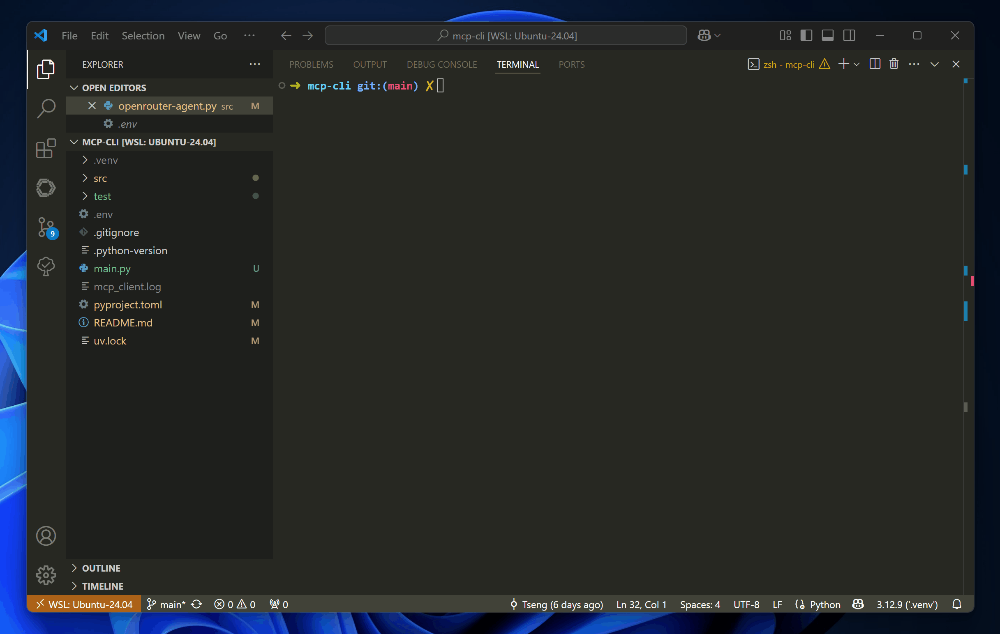

## 摘要

当前实现的功能：基于 MCP stdio 和 OpenRouter 的简单 Agent 工具，已集成 [@modelcontextprotocol/server-filesystem](https://github.com/modelcontextprotocol/servers/blob/main/src/filesystem/README.md) 文件系统 MCP，可持续扩展其他 stdio 格式 MCP。

## 介绍

这是一个简单的 MCP 工具，目前实现了一个交互式的基于 OpenRouter Claude 大模型 + Filesystem MCP 的应用。

本质上这是作者用于验证 MCP 协议的一个 Demo 作品，你可以在此基础上看看 MCP 的玩法并做一些拓展。

整体来说，MCP 作为标准化的大模型外挂，确实给大模型应用开发提供了一条康庄大道，随着未来越来越多的 MCP 工具支持，基于大模型的应用能力可以期待了。

后续计划用 [Fastmcp](https://github.com/jlowin/fastmcp) 做进一步的探索和验证。

## 依赖

请确保你的执行环境已经按照如下依赖：

1. Python
2. Node.js
3. [uv](https://docs.astral.sh/uv/)

同时确保你已经拿到 [OpenRouter](https://openrouter.ai/) 的 API Key。

## 使用

1. 使用 uv 安装依赖: `uv sync`
2. 配置 `src/config.py`，如 `ALLOWED_PATH` 变量
3. 配置 `.env` 环境变量，设置 `OPENAI_API_KEY=YOUR_OPENROUTER_API_KEY`
4. 启动 `source .venv/bin/activate`，Windows 使用：`.venv\Scripts\activate`
5. 运行 `python src/openrouter-agent.py`
6. 调试 `python src/openrouter-agent.py --debug`
